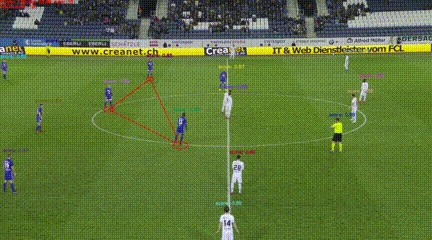
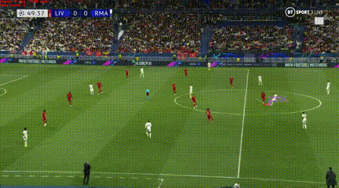
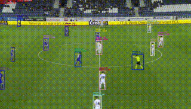
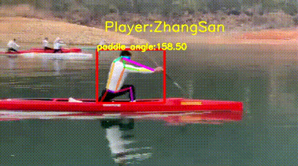
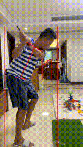

# Sports_Game_tracker 体育赛事视频识别追踪工具集

**Sports_Game_tracker是基于飞桨深度学习框架的实时行人分析工具[PP-Human](https://github.com/PaddlePaddle/PaddleDetection/tree/develop/deploy/pipeline)进行功能扩展的赛事识别追踪工具集，目前的功能有：运动员追踪、足球控球检测、足球检测、动作关键点检测、运动速度粗算、球员队伍分类、单人环境过滤、划船姿态、滑雪姿态、球员高亮、球类飞行轨迹拟合等**

OpenI启智平台链接：[Learning-Develop-Union/Sports_Game_tracker: Sports_Game_tracker](https://git.openi.org.cn/Learning-Develop-Union/Sports_Game_tracker)

Github链接：[KirigiriSuzumiya/Sports_Game_Tracker: Sports_Game_tracker](https://github.com/KirigiriSuzumiya/Sports_Game_Tracker)

|          功能          |                            效果图                            |                所需模型                |
| :--------------------: | :----------------------------------------------------------: | :------------------------------------: |
|   **球员与足球追踪**   |                   |           球员检测、足球检测           |
|   **球员高亮与链接**   |   |           球员检测、人像分割           |
|  **球类飞行轨迹拟合**  |                               |                足球检测                |
|      **球队分类**      |                     |                球员检测                |
|  新！**球员号码识别**  |  | 球员检测、骨骼关键点检测、光学字符识别 |
| **滑雪姿态与单人过滤** |                          |        球员检测、骨骼关键点检测        |
| **划船姿态与船桨角度** |                               |        球员检测、骨骼关键点检测        |
| **高尔夫肩髋动作纠正** |                               |        球员检测、骨骼关键点检测        |
|   **更多功能与想法**   |        **更多功能锐意开发中~欢迎大家提出需求！！！**         |                   ……                   |


或者有**B站视频**展示：[为体育赛事动态可视而生！基于PP-Human的体育视频追踪工具集](https://www.bilibili.com/video/BV1LG4y1n7LV) 

## 1. 快速开始

### 1.1 环境准备

PaddlePaddle和Sports_Game_tracker安装

```shell
# PaddlePaddle CUDA10.1
python -m pip install paddlepaddle-gpu==2.2.2.post101 -f https://www.paddlepaddle.org.cn/whl/linux/mkl/avx/stable.html

# PaddlePaddle CPU
python -m pip install paddlepaddle -i https://mirror.baidu.com/pypi/simple

# 安装其他依赖
cd Sports_Game_tracker
pip install -r requirements.txt
```

详细安装文档参考[文档](https://github.com/PaddlePaddle/PaddleDetection/blob/develop/docs/tutorials/INSTALL_cn.md)


### 1.2 下载模型

前往[模型下载地址](https://aistudio.baidu.com/aistudio/datasetdetail/161855)下载模型，并解压到[model](model/)目录下

| 功能     | 模型名                            |
| -------- | --------------------------------- |
| 球员检测 | mot_ppyoloe_l_36e_pipeline        |
| 足球检测 | ppyoloe_crn_l_80e_football        |
| 控球检测 | ppyoloe_crn_s_80e_person_football |

其中，足球追踪任务需要`足球检测`模型；球员追踪及控球检测需要`球员检测`及`控球检测`模型


### 1.3 预测部署

```shell
# 足球追踪检测
python pipeline\pipeline.py --config pipeline/config/infer_cfg_pphuman_football.yml --draw_center_traj --video_file=path_to_your_video --device=gpu --output_dir=output/football

#球员追踪及控球检测
python pipeline\pipeline.py --config pipeline/config/infer_cfg_pphuman_player.yml --video_file=path_to_your_video --device=gpu --output_dir=output/player

#动作追踪与速度粗算
python pipeline\pipeline.py --config pipeline/config/infer_cfg_pphuman_ski.yml --video_file=path_to_your_video --device=gpu --output_dir=output/ski/speed --speed_predict

#单人滑雪追踪
python pipeline\pipeline.py --config pipeline/config/infer_cfg_pphuman_ski.yml --video_file=path_to_your_video --device=gpu --output_dir=output/ski --singleplayer skier
```


## 2. 配置文件与参数说明

### 2.1 配置文件

相关配置位于[pipeline/config](pipeline/config/)路径下，功能及配置文件对应表单如下：

| 功能               | 配置文件                                                     | 追踪配置文件                                                 |
| ------------------ | ------------------------------------------------------------ | ------------------------------------------------------------ |
| 球员追踪与控球检测 | [infer_cfg_pphuman_player.yml](pipeline/config/infer_cfg_pphuman_player.yml) | [tracker_config_player.yml](pipeline/config/tracker_config_player.yml) |
| 足球追踪           | [infer_cfg_pphuman_football.yml](pipeline/config/infer_cfg_pphuman_football.yml) | [tracker_config_football.yml](pipeline/config/tracker_config_football.yml) |
| 滑雪追踪           | [infer_cfg_pphuman_ski.yml](pipeline/config/infer_cfg_pphuman_ski.yml) | [tracker_config_player.yml](pipeline/config/tracker_config_player.yml) |

具体配置及模型替换等参阅：[链接](https://github.com/PaddlePaddle/PaddleDetection/blob/develop/deploy/pipeline/docs/tutorials/PPHuman_QUICK_STARTED.md#%E9%85%8D%E7%BD%AE%E6%96%87%E4%BB%B6%E8%AF%B4%E6%98%8E)


### 2.2 参数说明

较PP-Human新增的参数：

| 参数            | 是否必须 | 含义                                                         |
| --------------- | -------- | ------------------------------------------------------------ |
| --speed_predict | Option   | 是否开启速度粗算，默认为False，未设置mapping_ratio时显示像素位移速度 |
| --mapping_ratio | Option   | 视频像素与实际距离对应，默认为None，输入两个浮点数，分别代表x轴与y轴对应的实际距离，需先开启`--speed_predict`如：`--mapping_ratio 30 100`代表视频全宽30米，全高100米。（对有透视变化的视频请勿使用） |
| --x_ratio       | Option   | x轴像素分段实际距离对应，每三个参数为一组。(x1,x2,dis)代表x1与x2之间映射x轴实际距离dis。需先开启`--speed_predict`如：`--x_ratio 23 45.5 5 `代表23到45.5之间实际距离为5米 |
| --y_ratio       | Option   | y轴像素分段实际距离对应，每三个参数为一组。(y1,y2,dis)代表x1与x2之间映射x轴实际距离dis。需先开启`--speed_predict`如：`--y_ratio 23 45.5 5 `代表23到45.5之间实际距离为5米 |
| --team_clas     | Option   | 基于颜色识别的运动员球队分类，接受4个字符串变量（color1,name1,color2,name2）。其中颜色接受的参数为：[black, white, blue, red, yellow, green, purple, orange]。如：`--team_clas white RMA red LIV` |
| --singleplayer  | Option   | 是否开启单人过滤，默认为None，输入一个字符串代表运动员名称，主要过滤站立的观众。如：`--singleplayer ZhangSan` |
| --boating       | Option   | 划船场景功能，默认为False，可用于测算手持船桨的角度          |
| --ball_drawing  | Option   | 统计全局球类检测结果，不分id得进行路径拟合，默认为False      |
| --link_player   | Option   | 高亮并连接给定id号的运动员，类似电视转播的效果，默认为False  |
| --golf          | Option   | 是否开启高尔夫肩髋动作纠正，默认为False                      |

PP-Human原有的参数：

> 来自PP-Human文档[链接](https://github.com/PaddlePaddle/PaddleDetection/blob/develop/deploy/pipeline/docs/tutorials/PPHuman_QUICK_STARTED.md)

| 参数                   | 是否必须 | 含义                                                         |
| ---------------------- | -------- | ------------------------------------------------------------ |
| --config               | Yes      | 配置文件路径                                                 |
| --model_dir            | Option   | PP-Human中各任务模型路径，优先级高于配置文件, 例如`--model_dir det=better_det/ attr=better_attr/` |
| --image_file           | Option   | 需要预测的图片                                               |
| --image_dir            | Option   | 要预测的图片文件夹路径                                       |
| --video_file           | Option   | 需要预测的视频                                               |
| --camera_id            | Option   | 用来预测的摄像头ID，默认为-1(表示不使用摄像头预测，可设置为：0 - (摄像头数目-1) )，预测过程中在可视化界面按`q`退出输出预测结果到：output/output.mp4 |
| --device               | Option   | 运行时的设备，可选择`CPU/GPU/XPU`，默认为`CPU`               |
| --output_dir           | Option   | 可视化结果保存的根目录，默认为output/                        |
| --run_mode             | Option   | 使用GPU时，默认为paddle, 可选（paddle/trt_fp32/trt_fp16/trt_int8） |
| --enable_mkldnn        | Option   | CPU预测中是否开启MKLDNN加速，默认为False                     |
| --cpu_threads          | Option   | 设置cpu线程数，默认为1                                       |
| --trt_calib_mode       | Option   | TensorRT是否使用校准功能，默认为False。使用TensorRT的int8功能时，需设置为True，使用PaddleSlim量化后的模型时需要设置为False |
| --do_entrance_counting | Option   | 是否统计出入口流量，默认为False                              |
| --draw_center_traj     | Option   | 是否绘制跟踪轨迹，默认为False                                |


## 3. 模型训练

### 3.1 足球追踪

使用PP-yoloe模型训练，数据集链接：[足球赛环境下足球目标标注 - 飞桨AI Studio (baidu.com)](https://aistudio.baidu.com/aistudio/datasetdetail/156077)

训练教程可参考：[多目标跟踪任务二次开发](https://github.com/PaddlePaddle/PaddleDetection/blob/develop/docs/advanced_tutorials/customization/pphuman_mot.md)

配置文件：

```yml
_BASE_: [
  '../datasets/final_dataset-football.yml',
  '../runtime.yml',
  '../ppyoloe/_base_/optimizer_300e.yml',
  '../ppyoloe/_base_/ppyoloe_crn.yml',
  '../ppyoloe/_base_/ppyoloe_reader.yml',
]

log_iter: 40
snapshot_epoch: 2
weights: output/ppyoloe_crn_l_80e_football/model_final

pretrain_weights: https://paddledet.bj.bcebos.com/models/ppyoloe_crn_l_80e_visdrone.pdparams
depth_mult: 1.0
width_mult: 1.0


epoch: 150
LearningRate:
  base_lr: 0.001
  schedulers:
    - !CosineDecay
      max_epochs: 150
    - !LinearWarmup
      start_factor: 0.
      epochs: 1

PPYOLOEHead:
  static_assigner_epoch: -1
```


### 3.2 控球检测

使用PP-yoloe模型训练，数据集链接：[足球赛环境下足球目标标注 - 飞桨AI Studio (baidu.com)](https://aistudio.baidu.com/aistudio/datasetdetail/156077)

训练教程可参考：[基于人体id的检测模型开发](https://github.com/PaddlePaddle/PaddleDetection/blob/develop/docs/advanced_tutorials/customization/action_recognotion/idbased_det.md)

配置文件：

```yml
_BASE_: [
  '../datasets/football.yml',
  '../runtime.yml',
  '../ppyoloe/_base_/optimizer_300e.yml',
  '../ppyoloe/_base_/ppyoloe_crn.yml',
  '../ppyoloe/_base_/ppyoloe_reader.yml',
]

log_iter: 100
snapshot_epoch: 10
weights: output/ppyoloe_crn_l_80e_person_football/model_final

pretrain_weights: https://paddledet.bj.bcebos.com/models/ppyoloe_crn_s_80e_visdrone.pdparams
depth_mult: 0.33
width_mult: 0.50


TrainReader:
  batch_size: 16

LearningRate:
  base_lr: 0.001

epoch: 80
LearningRate:
  base_lr: 0.001
  schedulers:
    - !CosineDecay
      max_epochs: 80
    - !LinearWarmup
      start_factor: 0.
      epochs: 1

PPYOLOEHead:
  static_assigner_epoch: -1
```


### 3.3 球员追踪

使用PP-Human的默认行人追踪模型

[PP-YOLOE Human 检测模型](https://github.com/PaddlePaddle/PaddleDetection/tree/develop/configs/pphuman)
