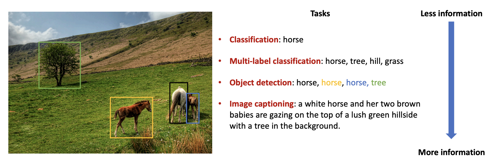

# Image Captioning 任务介绍

视觉和语言是人类获取信息的两种主要方式。从我们会讲话开始，我们就能用语言描述我们的所见，这是人类的一项基本能力，因此我们希望AI也能拥有这项能力，与之相关的任务便是image captioning。和其他的计算机视觉任务相比，image captioning任务可以提供更多的抽象信息，比如除了图像中的物体标签信息，image captioning还可以提供物体间的关系。

通常 image captioning 模型可以分为以下几类
* 基于检索的 image captioning 模型 -- 给一张图像，模型从数据库中检索出描述的文本。这类模型的缺点是只能检索数据库里已有的文本。
* 基于模板的 image captioning 模型 -- 给一张图片和一个模板，模型需要填充模板中的空白。
* 基于深度学习的端到端的 image captioning 模型。
* 混合 image captioning 模型。

一个image captioning模型至少包含三个部分
* 视觉理解模型 -- 提取图像特征，比如CNN，Faster-RCNN。
* 自然语言生成模型 -- 将图像特征翻译成文字，比如LSTM，Transformer。
* 视觉和语言模型的连接 -- 比较流行的模型是注意力机制。

Image captioning有多种应用，比如商品描述生成，广告文本的自动生成以及新闻文本的自动生成。在体育领域应用比较广泛的就是新闻文本的自动化生成。一篇体育新闻往往有各种各样的数据，比如比分数据，精彩集锦以及明星运动员的个人介绍等，其中精彩集锦的描述以及运动员介绍等都可以通过 image captioning 技术来完成。


# Paddle-AoA-Captioning
这个repository来自[这里](https://github.com/Lieberk/Paddle-AoANet), 我们十分感谢作者的贡献。

## 简介
参考论文：《Attention on Attention for Image Captioning》[论文链接](https://arxiv.org/abs/1908.06954v2)

注意力机制在当前的图像描述编解器框架中广泛使用，其中在每个时间步生成图像编码向量的加权平均值以指导解码器的生成过程。 
但是，解码器几乎不了解相关向量和给定注意力查询之间的关系或关联程度如何，这可能会使解码器给出错误的结果。
在本论文中，作者提出了一个“Attention on Attention”(AoA)模块，该模块扩展了常规的注意力机制，以确定注意力结果和查询结果的相关性。
AoA首先使用注意力的结果和当前的上下文生成一个“信息向量”和一个“注意力门”，然后通过对它们进行逐元素乘法来增加额外的注意力，最终获得“关注信息”，即预期的有用知识。
论文将AoA应用于图像描述模型的编码器和解码器中，将其命名为AoA Network（AoANet）。实验表明，AoANet的性能优于以前发布的所有方法。

[在线 AI Studio项目地址](https://aistudio.baidu.com/aistudio/projectdetail/2879640)

[参考项目地址](https://github.com/husthuaan/AoANet)

## 环境依赖
paddlepaddle-gpu==2.1.2  cuda 10.2

opencv-python==4.5.3.56

yacs==0.1.7

yaml==0.2.5

**安装**
```bash
pip install -r requestments.txt
```

## 数据准备
coco2014 image captions [论文](https://link.springer.com/chapter/10.1007/978-3-319-10602-1_48), 采用“Karpathy” data split [论文](https://arxiv.org/pdf/1412.2306v2.pdf)

[coco2014数据集下载](https://aistudio.baidu.com/aistudio/datasetdetail/28191)

- 数据集总大小：123287张
  - 训练集：113287张
  - 验证集：5000张
  - 测试集：5000张
- 标签文件：dataset_coco.json

## 快速开始

### step1: 加载数据
加载预处理数据文件全放在本repo的data/下 

[“Karpathy” data split json](https://aistudio.baidu.com/aistudio/datasetdetail/107078)

通过Faster R-CNN模型提取的Bottom-up 原始特征文件[链接](https://github.com/ruotianluo/ImageCaptioning.pytorch/blob/master/data/README.md)

生成cocotalk_label.h5和cocoktalk.json文件
```bash
python scripts/prepro_labels.py
```

生成cocobu_att、池化特征cocobu_fc、边框特征cocobu_box
```bash
python scripts/make_bu_data.py
```

可以直接[加载上述预训练数据](https://aistudio.baidu.com/aistudio/datasetdetail/107198)
其中cocobu_att分成cocobu_att_train和cocobu_att_val上传，加载完成后，要合并成cocobu_att

### step2: 训练
训练过程过程分为两步：Cross-entropy Training和SCST(Self-critical Sequence Training)

第一步Cross-entropy Training：

```bash
python3 train.py --cfg configs/aoa.yml  
```

第二步SCST(Self-critical Sequence Training)：

```bash
python3 train.py --cfg configs/aoa_rl.yml
```

训练的模型数据和日志会放在本repo的log/下

### step3: 验证评估

验证模型
```bash
python eval.py
```

测试时程序会加载本repo的log/下保存的训练模型数据，我们最终验证评估的是使用SCST优化的模型。

可以[下载训练好的模型数据](https://aistudio.baidu.com/aistudio/datasetdetail/112308), 放到本repo的log/下，然后直接执行验证指令。

## 精度
代码在coco2014数据集上训练，复现精度：

Cross-entropy Training

|Bleu_1|Bleu_2|Bleu_3|Bleu_4|METEOR|ROUGE_L|CIDEr|SPICE|
| :---: | :---: | :---: | :---: | :---: | :---: | :---: | :---: | 
|0.778|0.623|0.485|0.377|0.284|0.578|1.187|0.215|

SCST(Self-critical Sequence Training)

|Bleu_1|Bleu_2|Bleu_3|Bleu_4|METEOR|ROUGE_L|CIDEr|SPICE|
| :---: | :---: | :---: | :---: | :---: | :---: | :---: | :---: | 
|0.810|0.658|0.511|0.391|0.286|0.589|1.283|0.220|

## TODO
目前该模型训练和测试都是基于Faster-RCNN提取的特征 (详细过程可以参考[这里](https://github.com/peteanderson80/bottom-up-attention))，因此如果想用这个模型来测试自己的图片，需要首先用[Faster-RCNN](https://github.com/peteanderson80/bottom-up-attention)进行特征提取，然后才能用eval.py文件进行caption生成。将来会支持端到端的测试方式，而不需要外部的Faster-RCNN。
