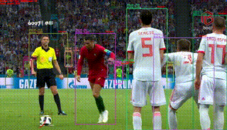
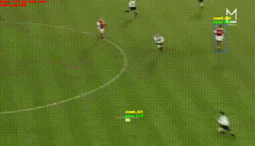
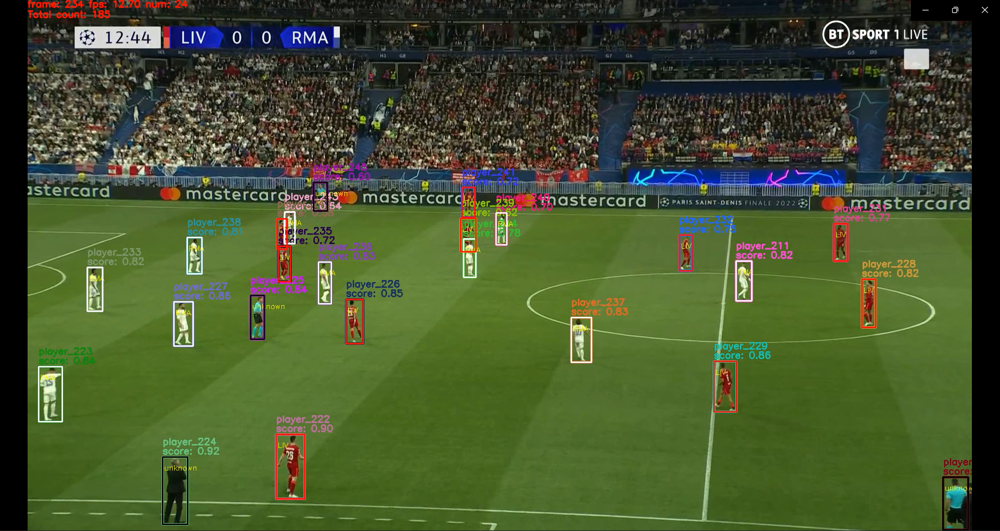

# 利用PP-Human完成足球赛追踪二次开发

**完整REPO位于[2.1.3-human/Sports_Game_Tracker](../../../02-sports_where/2.1-2D_detection/2.1.3-human/Sports_Game_Tracker/)，此处展示部分可视化结果与二次开发流程**

## 1. 足球追踪二次开发

从模型训练到预测推理完整流程教程：

[【PP-Human】飞桨看FIFA——足球赛识别追踪改良 - 飞桨AI Studio (baidu.com)](https://aistudio.baidu.com/aistudio/projectdetail/4306730)

（该AIstudio项目中使用的是稳定版的PP-Human主要介绍如何训练自己的数据集完成追踪任务）

### 2. 球队分类二次开发

**可视化效果介绍：白色皇马，红色利物浦，黑色其他无关人员**

开发简单可视化功能的完整流程教程：

[手把手教你为PP-Human添加简单的自定义功能 - 飞桨AI Studio (baidu.com)](https://aistudio.baidu.com/aistudio/projectdetail/4415732)

（该AIstudio项目中使用的是develop版的PP-Human主要介绍如何修改pipeline文件实现自己需要的可视化功能）