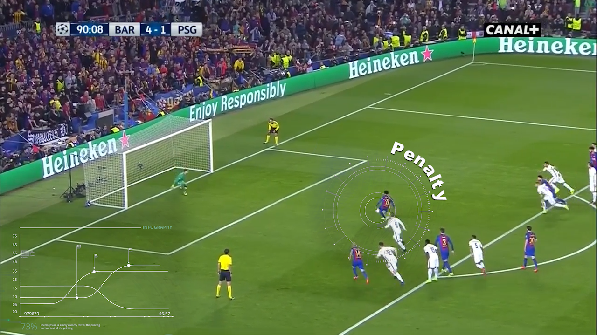

# Pretrained Soccernet Features

This [repo](https://github.com/baidu-research/vidpress-sports) contains the pretrained Soccernet features winning the CVPR 2021 ActivityNet Challange, Temporal Localization track, SoccerNet Challenge for 2021 and 2022.

# Train your own model

A better model than the Pretrained Soccernet Features has yet to be trained on Soccernet data and the repo will be updated once such models are available. The code provided here is to help you train your own model to do inference on other data or research. The training setup assumes a [Kinetics](https://www.deepmind.com/open-source/kinetics) style training (not considering class imbalances, more complicated sampling as originally done) so that it is most forward compatible with new models.

## Generate low resolution clips

In this section, we will be extracting short 10 seconds clips from the Soccernet videos and the clips will have a lower resolution for training.

Download raw HQ video data from the [Soccernet official website](https://www.soccer-net.org/download). Put it in a folder and set $RAW_VIDEOS_ROOT to that folder.

Run the following command. The output is commands to extract the clips. Redirect the output into a file because there are many extraction commands and you will need to split the file to run the commands in parallel. Choose a folder and set the environment variable $CLIPS_FOLDER to save your clips.

    python data/soccernet/generate_training_short_clips.py --input_folder $RAW_VIDEOS_ROOT --clips_folder=$CLIPS_FOLDER > data/soccernet/generate_training_short_clips.sh

Make a folder to save the paralle scripts:

    mkdir data/soccernet/short_clips_parallel

This is a sample to split into 400 equal parts:

    for i in {0..399};
    do
        sed -n ${i}~400p data/soccernet/generate_training_short_clips.sh > data/soccernet/short_clips_parallel/${i}.sh;
    done

The commands may get stuck on a few videos and render the jobs stuck, so here is another split into 401 parts to run after the above job.

    for i in {0..400};
    do
        sed -n ${i}~401p data/soccernet/generate_training_short_clips.sh > data/soccernet/short_clips_parallel_401/${i}.sh;
    done

## Run the jobs

Sample code to run them on a slurm based cluster:

    for i in {0..399};
    do
    sbatch -p 1080Ti,2080Ti,TitanXx8  --gres=gpu:1 --cpus-per-task 4 -n 1 --wrap \
    "echo no | bash data/soccernet/short_clips_parallel/${i}.sh" \
    --output="data/soccernet/short_clips_parallel/${i}.log"
    done

For the seconds split,

    for i in {0..400};
    do
    sbatch -p 1080Ti,2080Ti,TitanXx8  --gres=gpu:1 --cpus-per-task 4 -n 1 --wrap \
    "echo no | bash data/soccernet/short_clips_parallel_401/${i}.sh" \
    --output="data/soccernet/short_clips_parallel_401/${i}.log"
    done

## Generate label files

Set $RAW_VIDEOS_ROOT to the root of the folder where all HQ Soccernet videos are downloaded into. Set $LABELS_ROOT to the folder where the labels are.

    python data/soccernet/generate_labels.py \
    --extension mkv \
    --raw_videos_root $RAW_VIDEOS_ROOT \
    --labels_root $LABELS_ROOT \
    --clips_folder $CLIPS_FOLDER

Convert the labels files into one list annotation.txt

    python data/soccernet/labels_to_pdvideo_format.py \
    --clips_folder $CLIPS_FOLDER \
    --output_folder $CLIPS_FOLDER

Split into train val test. $SPLITS_FOLDER contains the Soccernet numpy files which contain the train, val, test match names.

    python data/soccernet/split_annotation_into_train_val_test.py \
    --splits_folder $SPLITS_FOLDER \
    --annotation_file $CLIPS_FOLDER/annotation.txt \
    --clips_folder $CLIPS_FOLDER

Now you should have train.list, val.list, test.list in $CLIPS_FOLDER that are in kinetics format that can be trained with any video classification model.

# Training with PaddleVideo

We provide an example of training feature extraction with the [PaddleVideo](https://github.com/PaddlePaddle/PaddleVideo) framework. There are approximately 300k clips without additional sampling so training speed would be a major consideration for training the backbone. We choose PaddleVideo's own implementation of the [TimeSformer](https://github.com/facebookresearch/TimeSformer) network to strike a good balance between training time and performance.

## Training steps
Make a folder data/soccernet in PaddleVideo. Put PaddleVideoConfigs/soccernet_pptimesformer_k400_videos.yaml in data/soccernet.

Train with
    python -u -B -m paddle.distributed.launch --gpus="0,1,2,3,4,5,6,7,8,9" --log_dir=log_videoswin main.py --validate -c data/soccernet/soccernet_pptimesformer_k400_videos.yaml

Or put the command in a bash file and use slurm.

Note
1. Compared to Kinetics training, we set equal sampling from the clips in the config since we need to cover the actual event in the short clip.

# Coming soon

1. Event detection with trained features. 