## 📣 近期更新

- **🔥2022.11.30 发布 "AI懂球帝"足球案例库**
  - 亮相WAVE SUMMIT+大会AI开发者集市，敬请关注；
  - 涵盖四大板块超15种算法及足球领域解决方案；
  - 💥"AI懂球帝"带你看世界杯 -- 卡塔尔世界杯示例demo更新;

效果加载可能较慢，可直接[下载](./image/)

|          功能          |                            效果展示                            |                所需模块                |
| :--------------------: | :----------------------------------------------------------: | :------------------------------------: |
|   **足球事件检测**   |         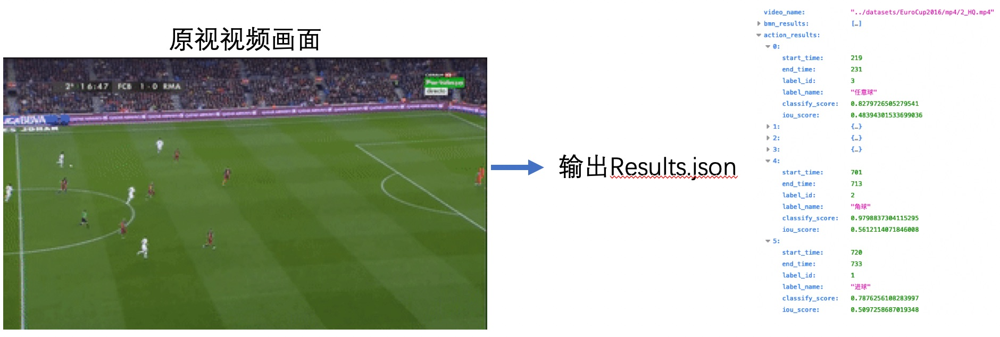          |           01-action           |
|   **球员、足球2D检测框 + 追踪轨迹**   |         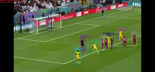           |           03-tracking           |
|   **球员图像分割**   | 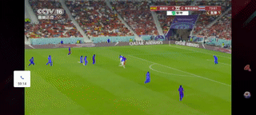  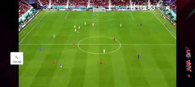  |           [人像分割](https://github.com/PaddlePaddle/PaddleSports/tree/develop/02-sports_where/2.2-2D_segmentation)           |
|  **足球2D/3D轨迹拟合**  |               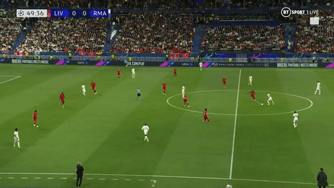              |                04-human_football                |
|      **3D虚拟还原+量化分析**      |                    |                [3D模块](https://github.com/PaddlePaddle/PaddleSports/tree/develop/02-sports_where)                |
|  **双方球员分类**  |  | [who模块](https://github.com/PaddlePaddle/PaddleSports/tree/develop/03-sports_who) |
|  **球员号码识别**  |  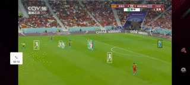 | 03-tracking |
|  **球员(球星)人脸识别**  | 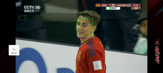 | 02-reid |
|  **多球员战术连线(攻、防三叉戟)**  | 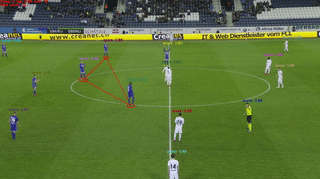 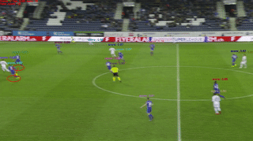 | [who模块](https://github.com/PaddlePaddle/PaddleSports/tree/develop/03-sports_who) |
|  **比分牌识别**  | 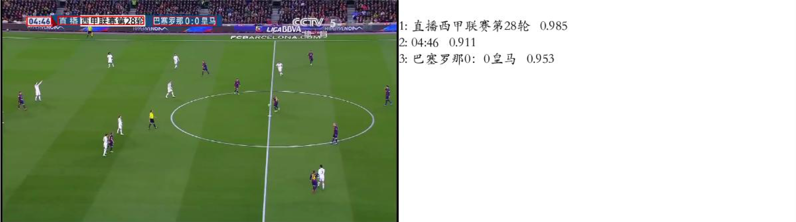 | 05-scoreboard_recognition |
|  **画质超分辨率**  |  | 06-super-resolution |
|  **视频帧生成文字描述(图生文)**  | 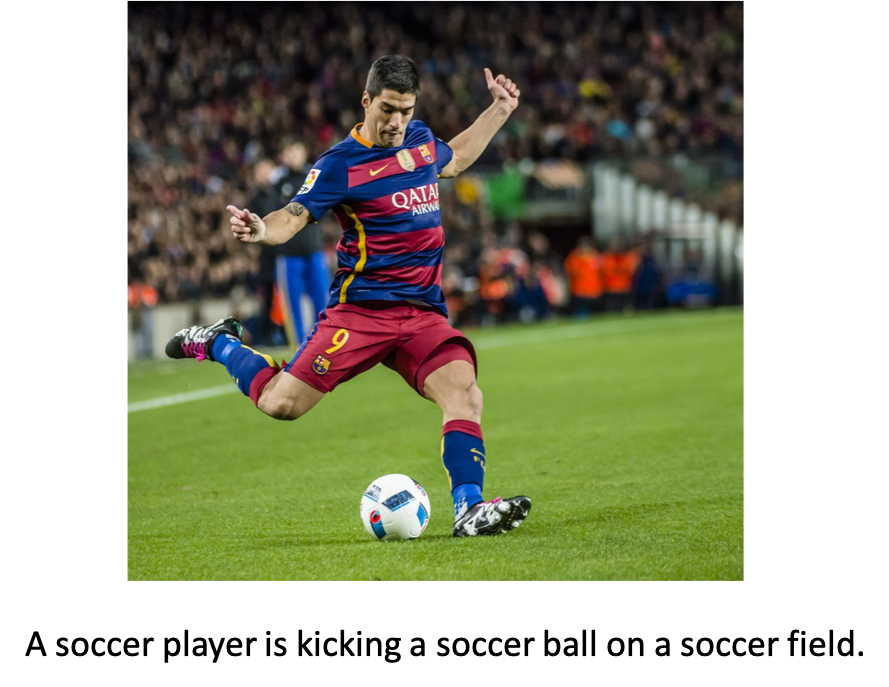 | 08-video caption |
|  **球员图像趣味风格化**  | 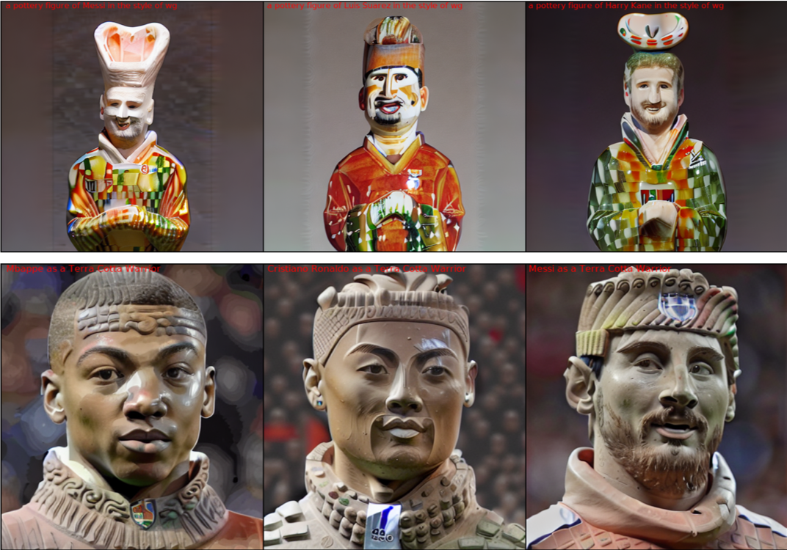 |  Release soon! |
|  **虚拟合成**  | 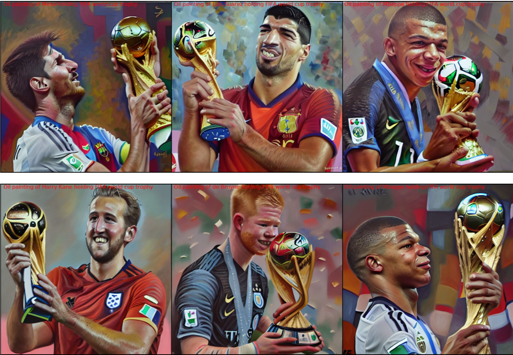 | Release soon! |
|   **更多功能与想法**   |        **更多功能锐意开发中~欢迎大家提出需求！！！**         |                   ……                   |

